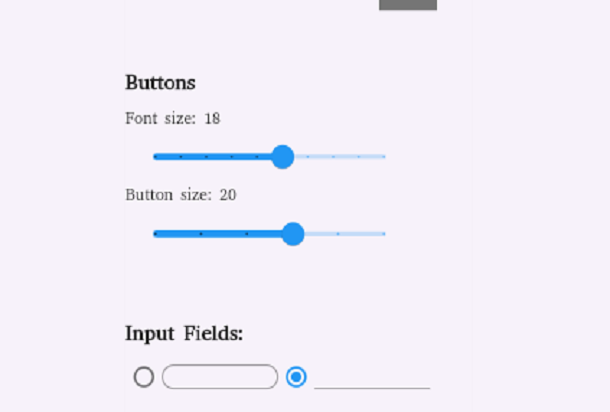
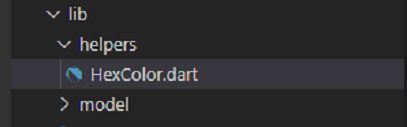

# Theme Designer

[](https://main.d3a5eqyieorqj5.amplifyapp.com/#/)

Theme Designer app that allows you to meticulously modify your interface's theme elements using **Material Library**. From color palettes to text styles and spacing, you have the authority to adapt our default yellow theme or establish your own. This user-friendly tool requires no design proficiency – simply make selections, preview adjustments, and implement. Elevate your digital encounter with the calculated customization of Theme Designer.

# Table of Contents

- [Usage](#usage)
    - [Users](#users)
        - `Choosing from the pre-defined themes`
        - `Customize colors`
        - `Customize text`
        - `Export theme`
        - `Update theme`
    - [Developers](#developers)
        - `Assets`
        - `Installation`
        - `Usage`
- [Demo](#demo)


# Usage 
Here is written the usage for the users of the theme designer to style their own themes using **theme designer**, and a developers to integrate it inside their app


## Users

You have two options:
1. Choose default theme and export JSON file.
2. Choose default theme and customize it for your liking.

### Use cases

  In the next pictures we will show **cases** of the app, what can be done to style theme: 

- Choose theme
- Customize color using color picker
- Customize text styles
- Export JSON file and update


### Choosing from the pre-defined themes


Here we are presented with the theme-designer pre-defined themes to make it easily to style your own theme. 

### Customize colors


In the colors tab its shown flutter material **color scheme** for styling primary, secondary, radio fill color  and more...

After we chose the color we want to change, it will pop up the modal for changin the new color.


### Customize text


In the style tab its shown properties to change:
-  **mode** of theme (dark or bright), 
-  **typography font used** (we can choose from the various fonts, all the fonts are used from the [link](https://www.fonts.google.com))
-  **headlines & normal (small, medium, large) text** (we can change font size of the style using range slider, and a style of the text - bold )
- **buttons styles** (we can change font size of a button inside, inner size of the button (to make it **large, sm, md**))
- **input styles** (input style to make it round with **outline border** or not)



### Saving (exporting) theme


Theme is saved in a **JSON** config file.

### Updating existing theme

After the config for the theme is **Exported**, we can update that theme with **upload theme** functionality


## Developers

### Assets

  1. To integrate our theme designer into your application, we will need firstly to install these flutter dependencies:
**fluttertoast**, **google_fonts**, **provider**

     **Command** for install: 

     ```
      flutter pub add fluttertoast google_fonts provider
     ```

  2. After its installed, in the **lib** folder of app: 
      - Create **model** **folder** and **copy** our ([assets/code/model/theme.dart](./assets/code/model/theme.dart)) inside model folder

       

      -  Create **helpers** **folder** and **copy** our ([assets/code/helpers/HexColor.dart](./assets/code/helpers/HexColor.dart)) inside helpers folder - this is function for using hex code color inside our app , the natively flutter uses RGB value

       

      - Copy our ([assets/code/theme_provider.dart](./assets/code/theme_provider.dart))  inside **lib** folder - this file is responsible for changing our theme globally inside our app


       

      - Create **assets/themes** folders in the rooot of the project and **copy** yours exported JSON **config.txt** (created in designer) 

       


### Installation

To use it we need to wrap our **MaterialApp** (**lib/main.dart**) with a **Provider** that is pron to changes, that provider is our ThemeProvider which we imported. Later on we can add multiple providers inside our app, based on this one.

Change this code inside **lib/main.dart** ::
  ```
MaterialApp(
      title: 'Flutter Demo',
      theme: ThemeData(
        // This is the theme of your application.
        //
        // Try running your application with "flutter run". You'll see the
        // application has a blue toolbar. Then, without quitting the app, try
        // changing the primarySwatch below to Colors.green and then invoke
        // "hot reload" (press "r" in the console where you ran "flutter run",
        // or simply save your changes to "hot reload" in a Flutter IDE).
        // Notice that the counter didn't reset back to zero; the application
        // is not restarted.
        primarySwatch: Colors.blue,
      ),
      home: const MyHomePage(title: 'Flutter Demo Home Page'),
    ); 

  ```
 into this:

 ```
ChangeNotifierProvider(
        create: (_) => ThemeProvider(),
        child: Consumer<ThemeProvider>(builder: (context, model, __) {
          return MaterialApp(
            title: 'Flutter Demo',
            theme: model.theme,
            home: SelectionArea(
                child: const MyHomePage(title: 'Flutter Demo Home Page')),
          );
        }));
 ```

- ThemeProvider is a provider for changes pron to our theme (colors, text, spacing), the  defaultly theme is set to yellow  (check **theme_provider.dart**)

- Inside ThemeProvider (**theme_provider.dart**) we have a function **setDynamicTheme** which we will use later to sent **CustomTheme** **model** which we imported earlier, 

- The **CustomTheme** instance will need to be created in our consumer of the provider (**main.dart**) using our config.txt which we exported earlier in flutter-theme-designer and import into **assets/themes/config.txt**.

- Inside main.dart stateful app create function **_importTheme** which will use our config as main **theme** inside our app.

```

void _importTheme() async {
    try {
      final String themeData =
          await rootBundle.loadString('assets/themes/config.txt');
      final provider = Provider.of<ThemeProvider>(this.context, listen: false);

      CustomTheme theme = CustomTheme().themeFromJson(themeData);
      provider
          .setDynamicTheme(theme); //setting our main theme to our config.txt,
    } catch (error) {
      Fluttertoast.showToast(
          msg: error.toString(),
          toastLength: Toast.LENGTH_LONG,
          webShowClose: true);
    }
  }

```

- Here is the full code of **main.dart** 


### Usage

- Call the function **_importTheme** from a button using **onPressed** event
- Use the color scheme inside app, e.g. Use the secondary color from the config in a text :: 
 
 


---
# Demo

